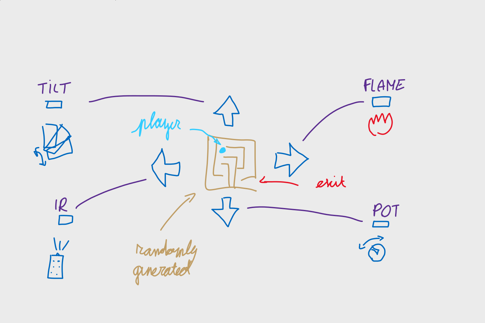

# hackathon-arduino-2020

Creating an escape room puzzle as a school project. (may-june 2020)

## Concept
In the middle of the room, there is a led matrix screen, that displays a randomly generated maze. A flashing matrix led indicates the player location.
At different sides of the room, there are placed 4 different sensors, each serving a purpose of moving the player in a certain direction. By triggering the right sensor, the player moves up/down/left/right. The player has the goal to escape the maze, which reveals a code on the screen needed for the next puzzle or to exit the room and escape.

The 4 sensors we are going to use are:
- Flame sensor, when triggered, the player moves right.
- IR receiver + remote control, which moves the player left when the right button is pressed.
- Potentiometer, when turned the right amount, moves the player down. When a potentiometer is used for the second time, it should first be turned back to the original location.
- Tilt(or shake?) sensor, when triggered, moves the player up.

This way, the puzzlers should be able to move the player to the exit of the maze.

An additional push button is used to reset the puzzle and generate a new maze.

## Contributors

### Stijn Rogiest [@CodeStix](https://github.com/CodeStix)

-   Maze generation

### Dylan Dedapper

-   Sensor Input

